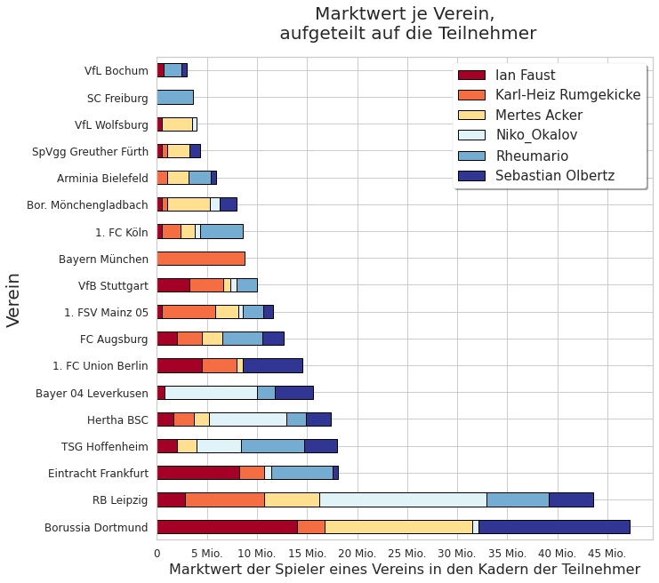
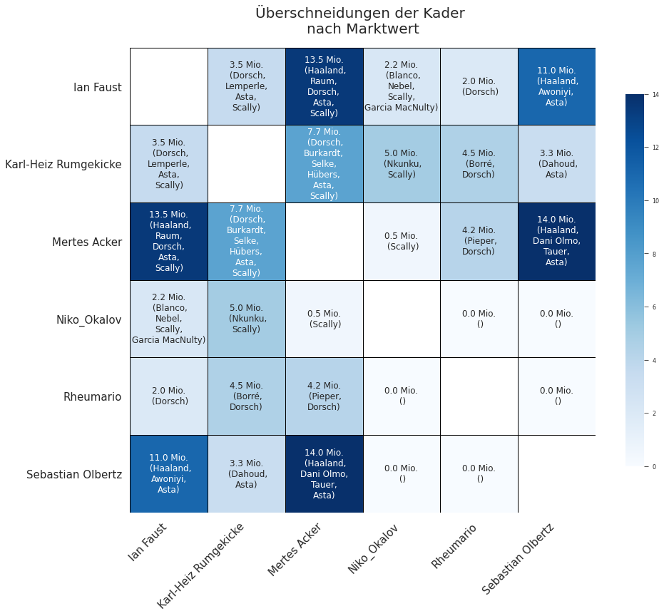

# Football Squad Analysis
Just for fun me and some friends are in a league of football managing. At the beginning of the season, we need to invest our budget in the players of the real world Bundesliga clubs. To see which clubs we favor and to see how similar our squads are, I came up with some visualisations. 
The data of the players has been exported directly from the game. The data of our squads is a manual export (a.k.a. I typed them down due to the lack of an API.)
All code is in the Jupyter notebook. 
My favourite visualisations are shown here:
(The labeling is in German, since the game is in German as well. But I hope it is understandable nonetheless.)

## Charts

